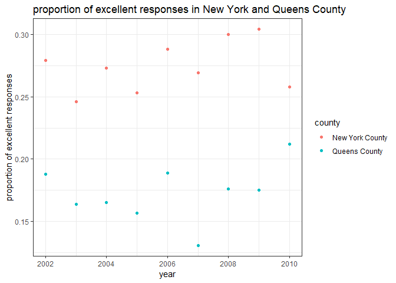

Homework2
================
Brennan Baker
September 26, 2018

-   [Problem 1](#problem-1)
-   [Problem 2](#problem-2)
-   [Problem 3](#problem-3)

Import packages.

``` r
library(tidyverse)
```

    ## -- Attaching packages ------------------------------------------------------------ tidyverse 1.2.1 --

    ## v ggplot2 3.0.0     v purrr   0.2.5
    ## v tibble  1.4.2     v dplyr   0.7.6
    ## v tidyr   0.8.1     v stringr 1.3.1
    ## v readr   1.1.1     v forcats 0.3.0

    ## -- Conflicts --------------------------------------------------------------- tidyverse_conflicts() --
    ## x dplyr::filter() masks stats::filter()
    ## x dplyr::lag()    masks stats::lag()

``` r
library(readxl)
```

Problem 1
---------

Read and clean the data; retain line, station, name, station latitude / longitude, routes served, entry, vending, entrance type, and ADA compliance. Convert the entry variable from character (YES vs NO) to a logical variable (the ifelse or recode function may be useful).

``` r
subway_data <- read_csv(file = "./data/NYC_Transit_Subway_Entrance_And_Exit_Data.csv") %>% 
  janitor::clean_names() %>% 
  select(line, station_name, station_latitude, station_longitude, starts_with("route"), entry, entrance_type, vending, ada) %>% 
  mutate(entry = recode(entry, 'YES' = TRUE, 'NO' = FALSE))
```

    ## Parsed with column specification:
    ## cols(
    ##   .default = col_character(),
    ##   `Station Latitude` = col_double(),
    ##   `Station Longitude` = col_double(),
    ##   Route8 = col_integer(),
    ##   Route9 = col_integer(),
    ##   Route10 = col_integer(),
    ##   Route11 = col_integer(),
    ##   ADA = col_logical(),
    ##   `Free Crossover` = col_logical(),
    ##   `Entrance Latitude` = col_double(),
    ##   `Entrance Longitude` = col_double()
    ## )

    ## See spec(...) for full column specifications.

This dataset contains NYC subway entrance and exit data. After importing the data, I cleaned the names and eliminated unnecessary variables. The resulting dataset contains the following variables: the line and station names, the longitude and latitude of each station, the routes that each station serves, whether or not each station allows entrance (entry), vending, and ADA compliance, and the type of entry. I changed the coding of the entry variable from YES/NO to TRUE/FALSE. The dataset contains 1868 rows and 19 columns. The data set is almost tidy because the columns are variables and the rows are observations. However, the route number columns contain information about two variables, the number of the route and the name of the route.

``` r
distinct_stations = subway_data %>% distinct(line, station_name, .keep_all = TRUE)
```

There are 465 distinct stations.

``` r
ada_compliant = filter(distinct_stations, ada == TRUE)
```

There are 84 ADA compliant stations.

``` r
no_vending_allow_entry = subway_data %>% #move back to subway_data because each station has multiple entrances. Thus, the distinct_stations data set does not contain all of the entrances
  filter(vending == "NO") %>% 
  filter(entry == TRUE)
```

There are 69 station entrances / exits without vending that allow entrance.

Reformat data so that route number and route name are distinct variables.

``` r
tidy_subway_data = subway_data %>% 
  gather(key = route_number, value = route_name, starts_with("route")) %>% 
  separate(route_number, into = c("remove", "route_number"), sep = "e") %>% 
  select(-remove)
```

How many distinct stations serve the A train? Of the stations that serve the A train, how many are ADA compliant?

``` r
a_train = tidy_subway_data %>% 
  distinct(line, station_name, .keep_all = TRUE) %>% #need distincy stations identified by name and line
  filter(route_name == "A")

ada_compliant2 = filter(a_train, ada == TRUE)
```

There are 60 distinct stations that serve the A. There are 17 ADA compliant stations that serve the A train.

Problem 2
---------

``` r
trash_data = read_excel(path = "./data/HealthyHarborWaterWheelTotals2017-9-26.xlsx", sheet = "Mr. Trash Wheel", range = cell_cols("A:M")) %>% 
  janitor::clean_names() %>% 
  mutate(sports_balls = round(sports_balls)) %>% 
  mutate(sports_balls = as.integer(sports_balls))

trash_data_2016 = trash_data %>% 
   filter(year == "2016")
```

The trash\_data dataset contains data about Mr. Trash Wheel, a contraption that removes trash from the Inner Harbor in Baltimore, Maryland. The data set has 360 rows and 13 columns. The data set details the weight and volume of trash collected by Mr. Trash Wheel into various dumpsters each month from May 2014 through August 2017. The types of trash are sorted into several categories including plastic bottels, grocery bags, sports balls, and other trash types. The median number of sports balls per dumpster in 2016 was 26.

``` r
rain_2016 = read_excel(path = "./data/HealthyHarborWaterWheelTotals2017-9-26.xlsx", sheet = "2016 Precipitation", range = cell_rows(2:14)) %>% 
  janitor::clean_names() %>%
  drop_na() %>% 
  mutate(year = "2016")

rain_2017 = read_excel(path = "./data/HealthyHarborWaterWheelTotals2017-9-26.xlsx", sheet = "2017 Precipitation", range = cell_rows(2:14)) %>% 
  janitor::clean_names() %>%
  drop_na() %>% 
  mutate(year = "2017")

rain_data = bind_rows(rain_2016, rain_2017) %>% 
  mutate(month = month.name[month]) %>% 
  rename(precipitation = total) %>% 
  select (year, month, precipitation)
```

The rain\_data data set contains precipitation data associated with the Mr. Trash Wheel project. Presumably, this data is about monthyl precipitation rates from January 2016 through August 2017 in the Inner Harbor in Baltimore, Maryland. The data set contains 20 rows and 3 columns. The variables are month, year, and precipitation. Thus, each row contains the total precipitation value from each given year and month.

Problem 3
---------

``` r
library(p8105.datasets)
#the line below installs the package
#devtools::install_github("p8105/p8105.datasets")
```

I will tidy the data by: cleaning the names; keeping only the rows where the topic is overall health; removing state from the county column and renaming so that one column has state and another column has county; and excluding unnecessary variables. I arranged by data\_value in order to investigate what range of values correspond to response (e.g. "Poor", "Very Good:).

``` r
brfss = brfss_smart2010 %>% 
  janitor::clean_names() %>% 
  filter(topic == "Overall Health") %>% 
  separate(locationdesc, into = c("state", "county"), sep = "- ") %>% 
  select(year, state, county, response, data_value) %>% 
  arrange(data_value)
```

Making values for response (“Excellent” to “Poor”) into column names with data value as the values in each cell. Also creating a new variable that is the proportion of excellent or very good responses.

``` r
brfss = brfss %>% 
  spread(key = response, value = data_value) %>% 
  janitor::clean_names() %>% 
  mutate(proportion_above_average = (excellent + very_good)/(fair + good + poor + excellent + very_good))
```

Find the number of unique locations, if every state is represented, and the state that appears most.

``` r
brfss_distinct = brfss %>% distinct(state, county, .keep_all = TRUE)

brfss_distinct %>% distinct(state) %>% View() # Here I saw 51 cols for each state + DC

brfss_distinct %>% count(state) %>% View() # Here I see that FL has the highest number
```

There are 404 unique locations and every state is represented in addition to DC. Florida appears the most (44 times).

``` r
brfss %>% filter(year == 2002) %>% 
  filter(!is.na(excellent)) %>% #with NA values I could not calculate the median
  summarize(median(excellent))
```

    ## # A tibble: 1 x 1
    ##   `median(excellent)`
    ##                 <dbl>
    ## 1                23.6

The median of the excellent response value in 2002 was 23.6.

``` r
brfss %>% filter(year == 2002) %>% 
  filter(!is.na(excellent)) %>%
  ggplot(aes(x = excellent))+
  geom_histogram() +
  labs(
    title = "excellent responses in 2002",
    x = "frequency",
    y = "response"
  ) + 
  theme_bw()
```

    ## `stat_bin()` using `bins = 30`. Pick better value with `binwidth`.


Filter data and plot proportion of “excellent” response values in New York County and Queens County in each year from 2002 to 2010.

``` r
brfss %>% 
  filter(county %in% c("New York County", "Queens County")) %>%
  mutate(proportion_excellent = (excellent)/(excellent + very_good + fair + good + poor)) %>% 
  ggplot(aes(x = year, y = proportion_excellent, color = county))+
  geom_point() +
  labs(
    title = "proportion of excellent responses in New York and Queens County",
    x = "year",
    y = "proportion of excellent responses"
  ) + 
  theme_bw()
```


